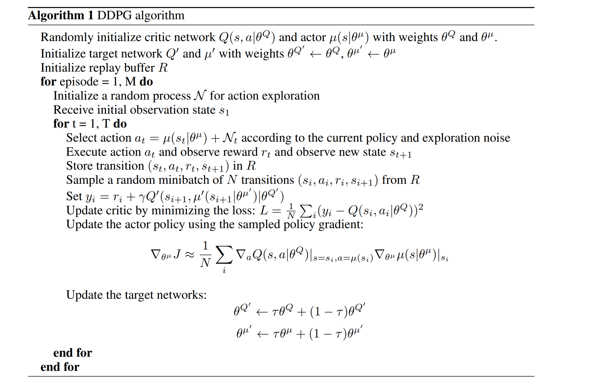
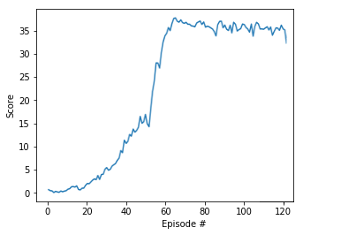

# Continuous Control

---

This Notebooks uses Unity's ML-Agents to solve a continuous control task where our agents will follow a green ball, for that we need to rotate our arms in the correct way.

### Set up

This code uses UnityEnvironment (In this case is a customized version from Udacity), NumPy, and PyTorch


```python
from unityagents import UnityEnvironment
import numpy as np
```


```python
env = UnityEnvironment(file_name='./Reacher_Windows_x86_64/Reacher.exe')
```

    INFO:unityagents:
    'Academy' started successfully!
    Unity Academy name: Academy
            Number of Brains: 1
            Number of External Brains : 1
            Lesson number : 0
            Reset Parameters :
    		goal_speed -> 1.0
    		goal_size -> 5.0
    Unity brain name: ReacherBrain
            Number of Visual Observations (per agent): 0
            Vector Observation space type: continuous
            Vector Observation space size (per agent): 33
            Number of stacked Vector Observation: 1
            Vector Action space type: continuous
            Vector Action space size (per agent): 4
            Vector Action descriptions: , , , 
    

Unity environments contain **_brains_** which are responsible for deciding the actions of their associated agents. Here we check for the first brain available, and set it as the default brain we will be controlling from Python.


```python
# get the default brain
brain_name = env.brain_names[0]
brain = env.brains[brain_name]
```

### The Environment

This simulation contains a 20 agents that will be solving the task but contributing to the same learning experience. We do this using DDPG and soft updates

At each time step, it has a continuous action of size 4 (a vector containing 4 values between -1 and 1) which controls the arm.


```python
# reset the environment
env_info = env.reset(train_mode=True)[brain_name]

# number of agents
num_agents = len(env_info.agents)
print('Number of agents:', num_agents)

# size of each action
action_size = brain.vector_action_space_size
print('Size of each action:', action_size)

# examine the state space 
states = env_info.vector_observations
state_size = states.shape[1]
print('There are {} agents. Each observes a state with length: {}'.format(states.shape[0], state_size))
print('The state for the first agent looks like:', states[0])
```

    Number of agents: 20
    Size of each action: 4
    There are 20 agents. Each observes a state with length: 33
    The state for the first agent looks like: [ 0.00000000e+00 -4.00000000e+00  0.00000000e+00  1.00000000e+00
     -0.00000000e+00 -0.00000000e+00 -4.37113883e-08  0.00000000e+00
      0.00000000e+00  0.00000000e+00  0.00000000e+00  0.00000000e+00
      0.00000000e+00  0.00000000e+00 -1.00000000e+01  0.00000000e+00
      1.00000000e+00 -0.00000000e+00 -0.00000000e+00 -4.37113883e-08
      0.00000000e+00  0.00000000e+00  0.00000000e+00  0.00000000e+00
      0.00000000e+00  0.00000000e+00  5.75471878e+00 -1.00000000e+00
      5.55726624e+00  0.00000000e+00  1.00000000e+00  0.00000000e+00
     -1.68164849e-01]
    

### How does the environment look and random policy


```python
env_info = env.reset(train_mode=False)[brain_name]     # reset the environment    
states = env_info.vector_observations                  # get the current state (for each agent)
scores = np.zeros(num_agents)                          # initialize the score (for each agent)
while True:
    actions = np.random.randn(num_agents, action_size) # select an action (for each agent)
    actions = np.clip(actions, -1, 1)                  # all actions between -1 and 1
    env_info = env.step(actions)[brain_name]           # send all actions to tne environment
    next_states = env_info.vector_observations         # get next state (for each agent)
    rewards = env_info.rewards                         # get reward (for each agent)
    dones = env_info.local_done                        # see if episode finished
    scores += env_info.rewards                         # update the score (for each agent)
    states = next_states                               # roll over states to next time step
    if np.any(dones):                                  # exit loop if episode finished
        break
print('Total score (averaged over agents) this episode: {}'.format(np.mean(scores)))
```

### Method

In order to solve this environment I decided to use a Acto-Critic algorithm based on [DDPG](https://arxiv.org/pdf/1509.02971.pdf), known as [Distributed Distributional Deep Deterministic Policy Gradient](https://arxiv.org/pdf/1804.08617.pdf) (D4PG for friends).

#### Why D4PG?
In order to answer this questions I would like to quote the original paper:

> In control tasks, commonly seen in the robotics domain, continuous action spaces are the norm.
For algorithms such as DQN the policy is only implicitly defined in terms of its value function,
with actions selected by maximizing this function. In the continuous control domain this would
require either a costly optimization step or discretization of the action space. While discretization is
perhaps the most straightforward solution, this can prove a particularly poor approximation in highdimensional settings or those that require finer grained control. Instead, a more principled approach
is to parameterize the policy explicitly and directly optimize the long term value of following this
policy.

Additional to this, we decided to solve an environment which contains 20 agents, hence the original DDPG does not allow for an optimal learning experience for our agents, but instead we use soft updates to update the policy. 

#### How does DDPG work?

Some people will define DDPG as a continuous action space version of DQN, and the similarity is quite undeniable since part of the tricks used are based on the DQN, for example using Target Networks and Replay Buffer. DDPG plays with creating an approximation to Q matrix (actor) and an approximation to the action value function (critic), using both help us reduce the variance of DQN methods as well as get a good performance for continuous action space. There is a very good read about this in [OpenAI learning platform](https://spinningup.openai.com/en/latest/algorithms/ddpg.html) as well as in the [Udacity Deep Reinforcement Learning nanodegree](https://udacity.com).

__Tricks__


We must remark that DDPG algorithms are off-policy algorithms, that means that the policy that we use to explore is different from the one we are using to exploit, this allow us to use experience replay, which seamlessly distribute the task of gathering experience.

Another advantage is that we use target networks, we should not forget that we do not really have a trained agent to which compare our policy, so in order to update our approximations, we are "basing our guess on another guess", this is quite inestable as we are continuously updating our network, that is why we use 2 networks per approximation, where one of them will be use as a target and will be updated less times to provide some kind of stability.

Last but not least, we have an approximation to Q values and an approximation to the action value function, given the Bellman equation for optimal action-value, we can use the mean-squared Bellman error (MSBE) to understand how good our approximation of Q is based on action-value function. 

On top of this we run several agents at the same time, all of them use the same networks when acting, and basically we use several agents in parallel to maximize the experience gathering of our network, allowing several agents to explore at the same time and increase the diversity of the samples in there. Then, we will perform a soft update were we use a noise function to update partially values within both approximations. 

##### Algorithms



#### The networks

The architecture of our model is quite simple. For both of them we are using a 3 layer Neural Network with respectively state_size, 256 and 128 units. 

Then they differ in the output, while the actor will output an action sized (4 in this case) with an activation function `tanh` (our action values are between -1 and 1, hence `tanh` is convenient). On the other side the critic network will output a singular value that correspond to the action-value approximation for the given state. We use `leaky relus` wherever I did not specify the activation function between layers or in the output.


```python
from collections import deque
import matplotlib.pyplot as plt
from agent import Agent
import torch
import time
from itertools import count

%matplotlib inline
```


```python
def ddpg(n_episodes=140, max_t=1000):
    """ Deep Deterministic Policy Gradients
    Params
    ======
        n_episodes (int): maximum number of training episodes
        max_t (int): maximum number of timesteps per episode
    """
    scores_window = deque(maxlen=100)
    scores = np.zeros(num_agents)
    scores_episode = []
    
    agents =[] 
    
    for i in range(num_agents):
        agents.append(Agent(state_size, action_size, random_seed=0))
    
    for i_episode in range(1, n_episodes+1):
        env_info = env.reset(train_mode=True)[brain_name]
        states = env_info.vector_observations
        
        for agent in agents:
            agent.reset()
            
        scores = np.zeros(num_agents)
            
        for t in range(max_t):
            actions = np.array([agents[i].act(states[i]) for i in range(num_agents)])
            env_info = env.step(actions)[brain_name]        # send the action to the environment
            next_states = env_info.vector_observations     # get the next state
            rewards = env_info.rewards                     # get the reward
            dones = env_info.local_done        
            
            for i in range(num_agents):
                agents[i].step(t,states[i], actions[i], rewards[i], next_states[i], dones[i]) 
 
            states = next_states
            scores += rewards
            if np.any(dones):
                break 
        score = np.mean(scores)
        scores_window.append(score)       # save most recent score
        scores_episode.append(score)

        if np.mean(scores_window)>=30.0:
            torch.save(Agent.actor_local.state_dict(), 'checkpoint_actor.pth')
            torch.save(Agent.critic_local.state_dict(), 'checkpoint_critic.pth')
            
    return scores_episode

scores = ddpg()

# plot the scores
fig = plt.figure()
ax = fig.add_subplot(111)
plt.plot(np.arange(len(scores)), scores)
plt.ylabel('Score')
plt.xlabel('Episode #')
plt.show()
```


    ---------------------------------------------------------------------------

    KeyboardInterrupt                         Traceback (most recent call last)

    <ipython-input-17-665e50faaab1> in <module>
         48     return scores_episode
         49 
    ---> 50 scores = ddpg()
         51 
         52 # plot the scores
    

    <ipython-input-17-665e50faaab1> in ddpg(n_episodes, max_t)
         32 
         33             for i in range(num_agents):
    ---> 34                 agents[i].step(t,states[i], actions[i], rewards[i], next_states[i], dones[i])
         35 
         36             states = next_states
    

    D:\Workspace\taxi-reinforcement-learning\deep-q-learning\continuous-control\agent.py in step(self, time_step, state, action, reward, next_state, done)
         96             for _ in range(N_UPDATES):
         97                 experiences = Agent.memory.sample()
    ---> 98                 self.learn(experiences, GAMMA)
         99 
        100     def act(self, state, add_noise=True):
    

    D:\Workspace\taxi-reinforcement-learning\deep-q-learning\continuous-control\agent.py in learn(self, experiences, gamma)
        134         # Get predicted next-state actions and Q values from target models
        135         actions_next = self.actor_target(next_states)
    --> 136         Q_targets_next = self.critic_target(next_states, actions_next)
        137         # Compute Q targets for current states (y_i)
        138         Q_targets = rewards + (gamma * Q_targets_next * (1 - dones))
    

    c:\program files\python\lib\site-packages\torch\nn\modules\module.py in __call__(self, *input, **kwargs)
        548             result = self._slow_forward(*input, **kwargs)
        549         else:
    --> 550             result = self.forward(*input, **kwargs)
        551         for hook in self._forward_hooks.values():
        552             hook_result = hook(self, input, result)
    

    D:\Workspace\taxi-reinforcement-learning\deep-q-learning\continuous-control\model.py in forward(self, state, action)
         69     def forward(self, state, action):
         70         """Build a critic (value) network that maps (state, action) pairs -> Q-values."""
    ---> 71         xs = F.leaky_relu(self.fcs1(state))
         72         x = torch.cat((xs, action), dim=1)
         73         x = F.leaky_relu(self.fc2(x))
    

    c:\program files\python\lib\site-packages\torch\nn\modules\module.py in __call__(self, *input, **kwargs)
        548             result = self._slow_forward(*input, **kwargs)
        549         else:
    --> 550             result = self.forward(*input, **kwargs)
        551         for hook in self._forward_hooks.values():
        552             hook_result = hook(self, input, result)
    

    c:\program files\python\lib\site-packages\torch\nn\modules\linear.py in forward(self, input)
         85 
         86     def forward(self, input):
    ---> 87         return F.linear(input, self.weight, self.bias)
         88 
         89     def extra_repr(self):
    

    c:\program files\python\lib\site-packages\torch\nn\functional.py in linear(input, weight, bias)
       1608     if input.dim() == 2 and bias is not None:
       1609         # fused op is marginally faster
    -> 1610         ret = torch.addmm(bias, input, weight.t())
       1611     else:
       1612         output = input.matmul(weight.t())
    

    KeyboardInterrupt: 




### Observe trained agents


```python
agent.actor_local.load_state_dict(torch.load('checkpoint_actor.pth', map_location=torch.device('cpu')))
agent.critic_local.load_state_dict(torch.load('checkpoint_critic.pth', map_location=torch.device('cpu')))

env_info = env.reset(train_mode=False)[brain_name]     # reset the environment    
states = env_info.vector_observations                  # get the current state (for each agent)
scores = np.zeros(num_agents)                          # initialize the score (for each agent)
while True:
    actions = agent.act(states)                        # select an action (for each agent)
    env_info = env.step(actions)[brain_name]           # send all actions to tne environment
    next_states = env_info.vector_observations         # get next state (for each agent)
    rewards = env_info.rewards                         # get reward (for each agent)
    dones = env_info.local_done                        # see if episode finished
    scores += env_info.rewards                         # update the score (for each agent)
    states = next_states                               # roll over states to next time step
    if np.any(dones):                                  # exit loop if episode finished
        break
print('Total score (averaged over agents) this episode: {}'.format(np.mean(scores)))
```

    Total score (averaged over agents) this episode: 36.52499918360263
    

### Future work

There are quite some improvements that I would like to try out in next iterations:

- __Correctly apply D4PG__, I believe that my current implementation is a variation on D4PG, I should take some more time to make sure I follow the D4PG algorithm correctly. In this implementation the learning took a lot of time

- __Apply Prioritized Experience Replay__, As in DQN, PER has proven to work quite well to increase the speed of learning as we only focus on the more relevant experiences.

- __Improve the model__, right now we use a very simplistic Neural Network, if we could add some regularization like Batch Normalization or Dropout layers. Also playing around with the hyperparameters would help us fine tune this. 


```python

```
